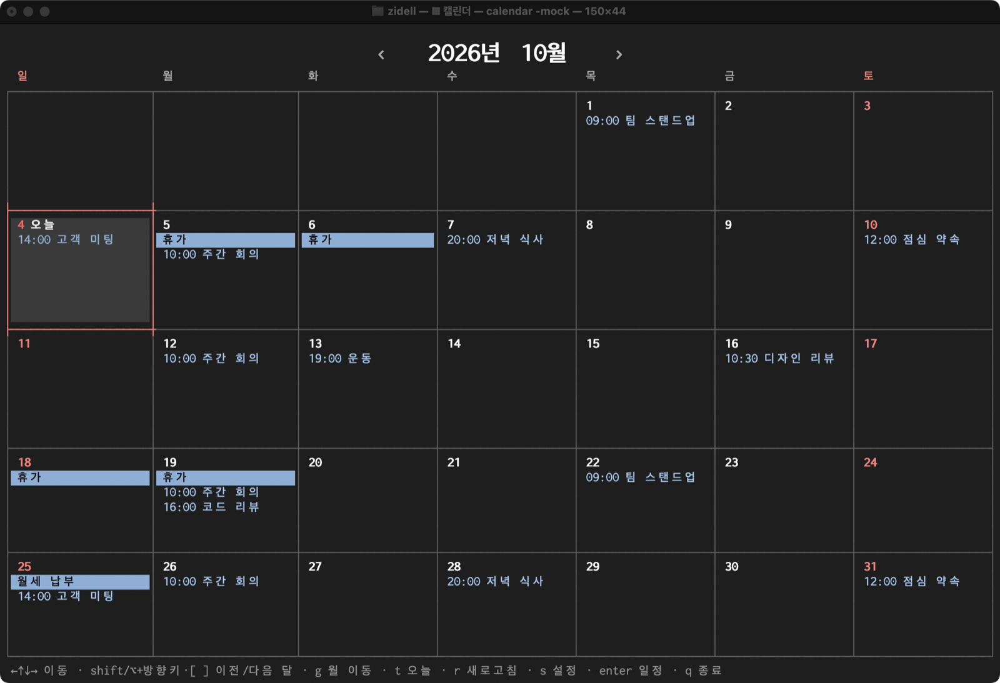

# calendar-tui

[한국어](README.md) · [English](README.en.md)

A lightweight monthly calendar that runs in the terminal. It reads and writes the Google and iCloud calendars already registered on your Mac.
Built with Go + [Bubble Tea](https://github.com/charmbracelet/bubbletea) + Lip Gloss.



## Requirements

- macOS (uses EventKit). On other OSes it only runs with mock events.
- Go and the Xcode Command Line Tools (EventKit and input-source APIs are called through cgo).
- Calendar accounts: add Google, iCloud, etc. in System Settings → Internet Accounts. You don't need to use the Apple Calendar app.
- Tuned for Terminal.app (Terminal on macOS 15 supports 256 colors).

## Install and run

```sh
scripts/package.sh --install   # installs /Applications/Calendar TUI.app and pins it to the Dock
```

- Click `Calendar TUI` (calendar icon) in the Dock, or open it from Launchpad or Spotlight. If a calendar window is already open it comes to the front; otherwise a Terminal window opens (filling the screen the first time). Window size and font size (`Cmd +/-`) are remembered for the next launch (font size is saved when you quit). While the calendar is running the Dock shows a running dot, and quitting the calendar (`q`) quits the app too.
- On first launch macOS asks to let "Calendar TUI control Terminal". Allow it so the app can open the window.
- To run without the app bundle:

```sh
go build -o calendar .
./calendar          # use your Mac calendar accounts
./calendar -mock    # in-memory mock events
```

- On first run macOS asks to let "Terminal access Calendars". Allow it (if denied, the app prints instructions and exits). To change it later: System Settings → Privacy & Security → Calendars.
- Saves and deletes are synced to the account (Google, etc.) by macOS.
- Changes made on other devices or apps appear as soon as macOS syncs them into the local calendar database (EventKit change notification). The app also re-reads when you return to the terminal window and when you press `r`, and once an hour as a fallback. How often macOS fetches from Google is up to macOS.
- Windows: cross-build with `GOOS=windows GOARCH=amd64 go build -o calendar.exe .` (mock events only, not tested on a real machine).

## Screen

- Three views, cycled with `v`. The last view is remembered.
  - **Month**: a calendar filling the screen, with each day's events in its cell. When the window is narrow, the column with the cursor is widened to a minimum width (default 30 characters) and the other columns shrink (never below 5).
  - **Week**: the week as a time grid. Events are placed as blocks at their times and split side by side when they overlap. All-day events sit at the top.
  - **Agenda**: days that have events, listed in order starting from the selected day.
- `‹` `›` beside the large title at the top move by a month (Month view) or a week (Week and Agenda views).
- Timed events use the calendar's color for their text; all-day events fill the whole line with the calendar color. When a cell is full you see `+N more`.
- Weekends and public holidays are red. Holiday and observance names appear next to the date instead of as event lines (holidays in red, observances dimmed).
- Today's cell has a border in the date color (white on weekdays, red on weekends and holidays). The selected day has a gray background.
- Viewing, adding, editing and deleting events happen in windows (modals) over the calendar.
  - `Enter` on a date → that day's event list. `+ New event` is at the top and selected by default. Repeating events show `(weekly)` etc.
  - `Enter` on an event → details (when, repeat, calendar, alert, location, link, notes) with `[Edit] [Duplicate] [Move] [Delete]`. Read-only calendars such as holidays and birthdays can't be edited (but can be duplicated).
  - Link: the URL field, or else the first link in the location or notes (Google Meet, Zoom, ...), opens in your browser with `o` or a click.
  - Add/Edit: title, all day, start/end, repeat (never, daily, weekly, monthly, yearly), alert (none, at start, 5/10/15/30 min, 1 hour, 1 day before; all-day events: 9am on the day, the day before, or a week before), calendar, location, URL, notes. New events default to the calendar you last saved to.
  - Duplicate opens that occurrence as a new non-repeating event in the form. Move changes only the date and keeps the time and length.
  - Editing, deleting or moving a repeating event asks **This event / All future events**.
- **Quick add** (`a`): type one line, e.g. `tomorrow 3pm lunch`, `fri 9:30am standup for 15m`, `oct 20 all day offsite`, or in Korean `내일 오후 3시 치과`, `금요일 10:30-12 리뷰`. No date means the selected day, no time means all day, no length means one hour. Hours 1–7 without am/pm are read as pm. Check the preview and press `Enter`, or `Tab` to continue in the full form.
- **Search** (`/`): titles, locations and notes of events within a year of today. Upcoming events first, then past ones. Picking a result goes to that day and opens its details; `esc` returns to the search.
- Windows that change something only commit when you press their button (`[Save]`, `[Delete]`, `[Go]`, `[Add]`). `esc` always closes without changing anything.
- Shortcuts work even with a Korean input method: the app switches the input source to English on shortcut screens and back to your input source in the title, location, notes, quick add and search fields, and restores it when you quit.
- The UI language is Korean or English (follows the system language), and the colors adapt to dark or light terminal backgrounds (change both in Settings → Display).

## Keys

| Screen | Key | Action |
|---|---|---|
| Calendar | `← ↑ ↓ →` / `hjkl` | Move by a day / a week (in Agenda, `↑ ↓` also move by a day) |
| | `[` `]` (`p` `n`, PgUp/PgDn, `Shift`/`Option`+arrows) | Previous / next month (Month) or week (Week, Agenda) |
| | `v` | Switch view: Month → Week → Agenda |
| | `a` | Quick add |
| | `/` | Search |
| | `g` | Go to a month (`2026-12`, `202612`, `12` = this year, `2027` = same month) |
| | `t` | Today |
| | `r` | Refresh |
| | `s` | Settings |
| | `Enter` | That day's events |
| | `q` | Quit |
| Any window | `esc` | Close (cancel) |
| Event list | `↑ ↓` / `Enter` | Select / open |
| | `a` | New event |
| Event details | `← →` / `Enter` | Select / run a button |
| | `e` / `c` / `m` / `d` | Edit / duplicate / move / delete |
| | `o` | Open link |
| Add/Edit | `↓` / `↑` (`Shift+Tab`) | Next / previous field |
| | `Tab` | Jump to `[Save]` (press again to go back to the title) |
| | `← →` `Space` | Toggle all day; change repeat, alert, calendar |
| | `Enter` | Next field (saves on `[Save]`) |
| | `Ctrl+S` | Save from anywhere |
| Quick add | `Enter` / `Tab` | Add / continue in the form |
| Search | `↑ ↓` / `Enter` | Select / open |
| Delete confirmation | `Enter` / `y` | Delete |
| Settings › Calendars | `Space` `Enter` | Toggle (applied with `[Save]` or `Ctrl+S`) |
| Settings › Display | `← →` `Space` | Change a value (applied with `[Save]` or `Ctrl+S`) |

### Mouse

- Month: click an event in a cell → its details. An empty part of a cell → new event on that day. The date line or `+N more` → that day's event list.
- Week: an event block → details, an empty hour → new event at that time, the date line → that day's event list. Agenda: an event line → details, a date line → that day's event list.
- `‹` `›` beside the title → previous / next (month or week); the title itself → go to a month (`g`).
- Clicking an event, button, setting or search result in a window selects it and presses `Enter`. The link line in the details opens the browser. In the form, click a field to move to it; all day toggles; repeat, alert and calendar step to the next value (click the `‹` side for the previous one).
- Clicking outside the window (the dimmed area) closes it (same as `esc`; unsaved edits are dropped).
- Because the app receives the mouse, turn off View → Allow Mouse Reporting (`Cmd+R`) in Terminal briefly if you want to drag-select text.

## Settings

`s` opens the settings menu.

- **Calendars**: turn calendars on and off, grouped by account (Google, iCloud, ...). Turning off an account hides all its calendars. New accounts and calendars are shown by default.
- **Display**: language (auto, 한국어, English), theme (auto, dark, light), week start (Sunday, Monday), time format (24-hour, 12-hour), and the minimum width of the selected day column when narrow (in characters; 0 disables widening).
- Settings file: `~/Library/Application Support/calendar-tui/config.toml` (print the path with `calendar --config-path`). `[display]` holds display settings, `[debug]` diagnostics, and `[accounts]` / `[calendars]` have one `"ID" = true/false` line per account and calendar (the comment at the end of the line is its name). Every item has an explanatory comment. You can edit it directly; the running app re-reads it as soon as you save. Check it with `calendar --check-config` (if it's invalid, the app keeps the previous values and shows the error at the bottom of the screen).
- Window size, font size, last view and last-used calendar are remembered automatically and kept separately in `state.json` in the same folder. An old `settings.json` is migrated on first run and kept as `.bak`.
- Follows the [Agent Configuration Accessibility](https://github.com/zidell/agent-configuration-accessibility) convention so AI agents can find and change settings from the installed app alone: `Contents/Resources/readme.txt` in the app bundle, `calendar --help`, and a comment on every item.

## Tips

- Text size: change it with `Cmd + +/-` or by resizing the window; the calendar re-fits.
- Line spacing can't be changed by the app. Use Terminal.app Settings → Profiles → Text → "Line spacing".
- Key log: set `[debug] key_log = true` in `config.toml` to record keys and clicks in `~/Library/Logs/calendar-tui/keys.log` (only the last 24 hours are kept). Useful to see what reaches the app when a shortcut doesn't work, or whether change notifications (`store changed`) arrive. It records typed text too, so it is off by default.

## License

MIT. See [LICENSE](LICENSE).
